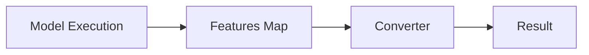

# Document Feature Implementation

Generate comprehensive documentation for a feature or code flow, suitable for newcomers.

## Input

Feature or component to document: $ARGUMENTS

## Parameters

Parse the arguments for optional flags:
- `--mermaid` or `-m`: Use Mermaid diagram syntax (renders in GitHub/GitLab)
- Default: Use simple ASCII diagrams

Example usage:
- `/document-feature PricingModelResult population` (ASCII diagrams)
- `/document-feature --mermaid PricingModelResult population` (Mermaid diagrams)

## Instructions

1. **Explore the codebase** to understand the feature:
   - Find the main entry points and key functions
   - Trace the data flow from input to output
   - Identify related files, types, and dependencies
   - Look for existing tests that demonstrate usage

2. **Create documentation** in `docs/` with the following structure:

### Required Sections

#### Overview
- What the feature does (1-2 paragraphs)
- High-level transformation/process steps (numbered list)

#### Architecture
- Diagram showing the data flow or component relationships (see Diagram Style below)
- Table of key source files with their purpose
- Navigation tip with search terms to find main entry points

##### Diagram Style

**Default (ASCII):** Use simple ASCII characters for maximum compatibility:
```
+------------------+     +------------------+     +------------------+
|                  |     |                  |     |                  |
|      Model       |---->|   Features Map   |---->|     Converter    |
|    Execution     |     |  Map[String,Val] |     |                  |
|                  |     |                  |     |                  |
+------------------+     +------------------+     +------------------+
                                                          |
                                                          v
                                                  +------------------+
                                                  |      Result      |
                                                  +------------------+
```

Rules for ASCII diagrams:
- Use `+`, `-`, `|` for boxes (not Unicode box-drawing characters)
- Use `---->` for horizontal arrows, `v` for downward arrows
- Keep diagrams narrow (max 80 characters wide)
- Align right edges by counting characters carefully

**With `--mermaid` flag:** Use Mermaid syntax for GitHub/GitLab rendering:


Rules for Mermaid diagrams:
- Use `flowchart LR` for left-to-right, `flowchart TD` for top-down
- Keep node labels concise
- Use subgraphs for grouping related components

#### Data Flow
- Step-by-step breakdown of how data moves through the system
- Code snippets for each step with search hints (e.g., "Search for `def functionName`")
- Example inputs/outputs at each stage

#### Key Components
- Important types, constants, and helper functions
- Tables for mappings (e.g., field mappings, enum conversions)

#### Code Examples
- 2-3 practical examples showing common usage patterns
- Include both success and error/edge cases

#### Troubleshooting
- Common issues with symptoms, causes, and solutions
- Debugging tips

#### Testing
- How to run relevant tests
- Search terms to find test files

#### Related Documentation
- Links to related docs in the project

### Formatting Guidelines

- Use GitHub-flavored markdown
- Use tables for structured data (field mappings, conversions, etc.)
- Use code blocks with `scala` syntax highlighting
- **Never use line numbers** in code references - use searchable terms instead:
  - Good: "Search for `def getMultiPricingModelResults`"
  - Bad: "See PricingModelResultConversions.scala:16-43"
- Use shortened paths in tables (e.g., `src/.../converters/` instead of full paths)
- Include navigation tips as blockquotes

### Output

Save the documentation to `docs/<feature-name>.md` where `<feature-name>` is a kebab-case version of the feature name.
